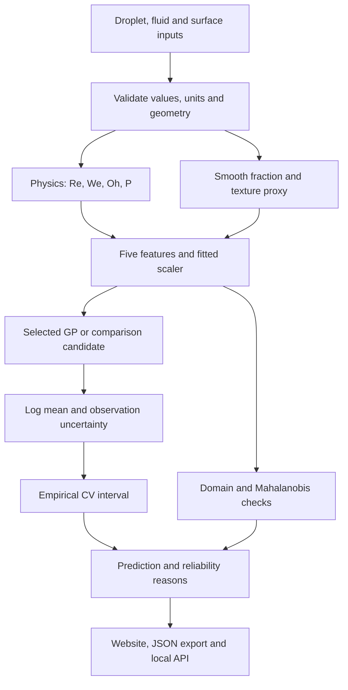
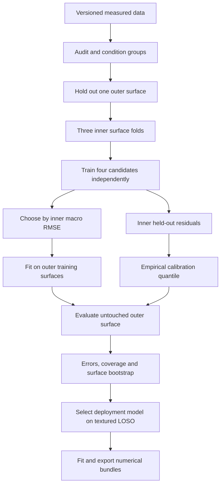

# Droplet Intelligence v2 — implemented architecture

This describes the shipped system. Earlier design alternatives are in DESIGN_PROPOSAL.md. Actual experiments are reported in results/REPORT.md. The original Matérn 3/2 GP remains the default because the new experiments did not establish robust predictive improvement.

## Live prediction

The website evaluates the real float64 GP in a Web Worker. Four numerical bundles load on demand; each Cholesky binary is checked against its SHA-256 hash. The hosted site is a static browser application. The included local server supplies Python HTTP endpoints.

## Training and validation

There are 48 outer fits, 144 inner fits and four final deployment fits. Fitted scalers, target normalization, optimizer initialization and the Laan parameter exclude held-out targets. REF-H is excluded from training and selection, but was historically inspected and is labelled a stress test.

## Models

| Candidate | Mean | Covariance |
|---|---|---|
| Baseline | Constant in log beta | Matérn 3/2 ARD + noise |
| Smooth alternative | Constant in log beta | Matérn 5/2 ARD + noise |
| Structured | Constant in log beta | a k_fluid + b k_surface + c k_fluid k_surface + noise |
| Physics residual | Training-fitted log Laan | Matérn 3/2 ARD + noise |

All candidates use ln(Re), ln(We), ln(D0/mm), phi and texture volume per area in micrometres. Surface identifiers are grouping labels and presets, not predictive features.

## Modules

| File | Purpose |
|---|---|
| data.py | CSV ingestion, physical features, condition IDs and audit |
| models.py | Four GP candidates and structured kernel |
| benchmark.py | Outer fits, comparisons and bootstrap |
| nested.py | Inner selection and test-surface-isolated CV calibration |
| export.py | Deployment fits, portable arrays and metadata |
| predict.py | Input validation and numerical inference |
| serve.py | Local HTTP API and dashboard |
| report.py | Reproducible report and plots |
| web/engine.mjs | Equivalent browser model |
| web/worker.mjs | Background inference and loading |
| web/app.mjs | Prediction, comparisons, data and methods |

## Scientific limits

Intervals have an empirical 90% target; no new-surface guarantee is asserted. Contact-angle coverage is incomplete. The 12 textured surfaces and fixed-width descriptor assumptions constrain extrapolation. Upstream SEM estimation was not independently cross-validated. The system exposes these limits explicitly.

## Release 2.1 SEM branch

The model now includes a trained three-view CNN on the supplied photographs. It estimates surface descriptors before GP prediction. Its independent image/impact LOSO evaluation, weak-label provenance and uncertainty limitations are in results/sem/REPORT.md. The existing four-candidate nested evaluation is unchanged and does not include this new branch.
