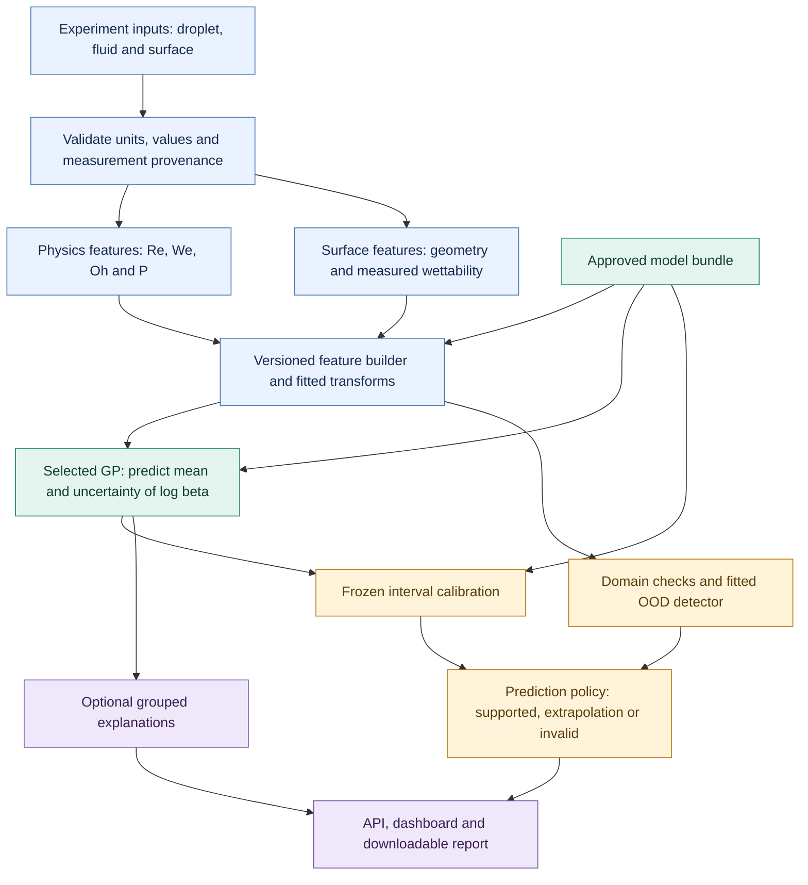
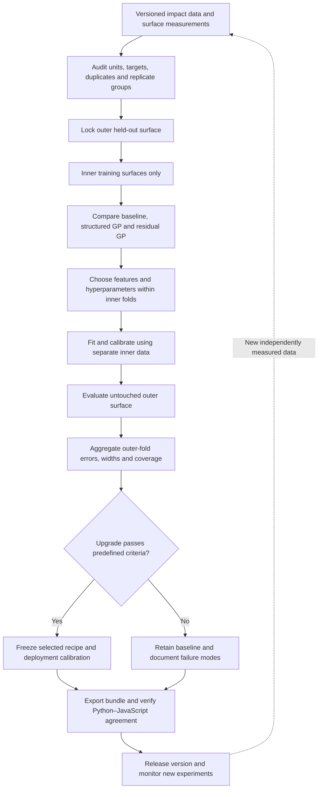
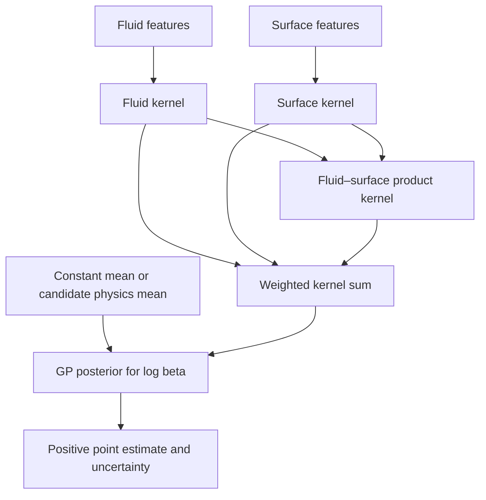

# Droplet Intelligence: System Architecture and Model Development Workflow

Prepared for Parth Sharma • 23 September 2026

**Status:** Architecture specification grounded in the supplied research paper and PART 1 code/results archive. Proposed models have not been trained or benchmarked in this review. Existing metrics below are archived results, not newly reproduced results. The original project files have not been modified.

## 1. Recommended design

Build around a **Gaussian process with separate fluid, surface, and fluid–surface interaction kernels**, evaluated against the existing five-feature GP. Add measured wettability only when it is available for the relevant fluid and surface. Keep physics-residual models as competing candidates. Promote an upgrade only after evaluation that isolates held-out surfaces from fitting, model selection, and calibration.

There are 1,498 textured-surface predictions, 12 textured surfaces, and another 125 REF-H predictions in the supplied artifacts. The number of independent surfaces is the main constraint on learning surface generalization. A larger neural network does not itself address this constraint.

## 2. Prediction architecture

This is the proposed production workflow. The model bundle determines which feature schema and predictor are active; optional branches cannot silently change an already trained model.

Explanations are an optional, slower path. Prediction requests should not wait for SHAP. Input failures terminate before physics calculations or logarithms; the diagram omits that error response for readability.

## 3. Training, selection and release workflow

Repeat the outer evaluation for all 12 surfaces. The entire selection procedure belongs inside each outer training fold. Outer results assess that procedure; repeatedly redesigning against those results makes them development evidence rather than an untouched final test. A new prospective test is needed after repeated development.

REF-H has already been inspected extensively. Retain it as a historical external stress test, but do not describe a newly redesigned model's REF-H result as a fresh blind test. Obtain a new smooth-surface or external-laboratory test for that claim.

## 4. What the supplied implementation actually contains

| Item | Verified artifact | Consequence for the architecture |
|---|---|---|
| Final predictor | `model_export/meta.json`: `model_key=GPR`, `backbone=null` | Current deployment uses a direct GP; a physics prior is not mandatory. |
| Input features | `logRe`, `logWe`, `logD`, `phi`, `texvol` | Preserve this five-feature baseline exactly for comparisons. |
| Transform | `core.py`, `phases.py`: natural logarithms; diameter feature uses mm | The paper's log-base-10 description differs from code. Preserve units in the bundle. |
| Kernel | `core.py`, `phases.py`: Matérn 3/2 ARD plus white noise | The paper says Matérn 5/2; correct that before publication. |
| Surface proxy | `surface.py`: `texvol=(1-phi)*depth` | It has units of length: texture volume per area, not cubic micrometres. |
| GP LOSO RMSE | `gpr_vs_xgb.json`: 0.0399728 | Historical baseline approximately 0.0400. |
| GP LOSO bootstrap interval | Same artifact: [0.0352491, 0.0451007] | Do not replace this with an unsupported ±0.0005 statement. |
| GP REF-H RMSE | `p7.json` and comparison JSON: 0.0590958 | The narrative value 0.0394 does not match the final archived results. |
| REF-H interval coverage | `p5.json`: 0.616 | The nominal 90% interval is substantially undercovered on smooth REF-H. |
| Same-feature XGBoost LOSO RMSE | `gpr_vs_xgb.json`: 0.0563363 | Archived GP reduction is about 29.0%, with wins on 9 of 12 surfaces. |
| Research OOD | `final_pipeline.py`: Mahalanobis and Isolation Forest | Both appear in evaluation. |
| Deployed OOD | `core.py`: Mahalanobis, ranges and rule warnings | Do not claim Isolation Forest is already in deployed prediction. |

The archived model labels also differ from the paper's table: for example, `p7.json` labels M1 as raw-input XGBoost, not a pure Laan law. Generate publication tables directly from a single canonical results file.

The bundle has 1,498 training rows and 125 separate REF-H predictions: 1,623 predictions across those sets. The paper should distinguish textured-training count from total count. Verify the raw experimental metadata before publishing material, imaging, geometry, or fluid-range claims; those were not re-audited from the raw dataset in this architecture review.

## 5. Physics and feature contract

Use SI internally: diameter D0 in m, speed U in m/s, density rho in kg/m³, viscosity mu in Pa·s, surface tension sigma in N/m. The UI can accept mm, micrometres and mPa·s with explicit conversion. Preserve the old baseline's documented mm-based diameter feature.

\[
Re=\frac{\rho U D_0}{\mu},\qquad
We=\frac{\rho U^2D_0}{\sigma},\qquad
Oh=\frac{\mu}{\sqrt{\rho\sigma D_0}}=\frac{\sqrt{We}}{Re},\qquad
P=We\,Re^{-2/5}.
\]

Compute all four for diagnostics. Do not assume adding all four as independent model inputs improves learning: Oh and P are determined by Re and We.

| Group | Baseline | Proposed experiments |
|---|---|---|
| Fluid and impact | ln(Re), ln(We), ln(D0/mm) | Retain baseline first; assess alternate representations inside inner validation. |
| Texture | phi, texture volume per area in µm | Compare phi with dimensionless texture volume per area divided by D0; ablate spacing/D0 and depth/D0 separately. |
| Wettability | Absent from final GP | Measured advancing angle, then hysteresis if available and supported by enough independent surfaces. |
| Measurement quality | Not explicit | Record uncertainty, instrument/source, temperature and whether descriptors were measured or inferred. |

Do not train a large feature set containing every dependent geometry proxy. Begin with a small representation and compare additions one at a time. Freeze descriptor extraction within each training fold; test-time SEM images may be used as supplied covariates, but pooled descriptor-extraction parameters should not be fitted on the outer test surface for an inductive evaluation.

For a square track grid, the existing proxy is:

\[
\phi=\left[\frac{\max(s-w,0)}{s}\right]^2,\qquad
v_{tex}=(1-\phi)h.
\]

This formula depends on the assumed geometry and track width. The existing code uses different fixed widths for deep and shallow classes. New depths or different track shapes require a measurement or a validated mapping; silently selecting a width at the current 15 µm threshold is not a general surface model.

Require finite positive D0, U, rho, mu and sigma for the log-feature model; zero-speed spreading needs a separate defined path. Validate nonnegative geometry and 0≤phi≤1. Track surface class explicitly instead of inferring it solely from a rounded phi value.

## 6. Proposed GP model family

Let u be fluid/impact features and z be the selected surface features. Model:

\[
y=\ln\beta_{max}=m(u,z)+f(u,z)+\epsilon.
\]

For the principal new candidate, use an additive and interaction kernel:

\[
k((u,z),(u',z'))=
a_f k_f(u,u')+a_s k_s(z,z')+
a_i k_f(u,u')k_s(z,z'),\quad a_f,a_s,a_i\ge0.
\]

The first component captures variation with impact conditions. The second captures surface differences. The product allows the effect of a surface to vary with impact conditions. Use Matérn components with regularized/bounded length scales and a modest search budget; the structure is a hypothesis to test, not an established improvement.

Compare these candidates under identical splits:

1. **B0: existing GP.** Same inputs, transforms and Matérn 3/2 kernel, with independent fold initialization.
2. **B1: structured GP.** Same measured information as B0; test the kernel architecture before adding data.
3. **B2: wettability GP.** B1 plus measured wettability. Use matched data subsets for fair ablation. The supplied code contains water advancing angles; they are not automatically measurements for every glycerol mixture. The assumed REF-H angle in code is not a replacement for measurement provenance.
4. **B3: physics-residual GP.** Compare constant mean against the existing Laan backbone and a separately verified wettability-aware relation. Do not force a backbone that previously provided only a small incremental gain.
5. **B4: replicate-informed noise.** Estimate a regularized observation-noise relationship using training replicates only. For new conditions, noise must be predicted from inputs; their unseen target variance cannot be supplied.

Keep same-input XGBoost as a comparator. Avoid combining every upgrade at once: the ablations must reveal which change helps.

The Laan-form expression implemented in the project is:

\[
\beta_{Laan}=Re^{1/5}\frac{\sqrt{P}}{A+\sqrt{P}}.
\]

If used, fit A only on training data and constrain it to physically admissible values. The proposed residual model predicts `ln(beta_Laan) + GP residual`. Verify the exact Lee variant and contact-angle definition against its primary source before including it as a publication model.

The current point prediction exp(mu_log) is the lognormal median. Under the GP's Gaussian log-space predictive distribution, exp(mu_log + variance_log/2) is the mean. Compare these estimators within inner validation if RMSE is the objective, and label the selected output explicitly. Do not switch the estimator only at export time.

## 7. Calibration without test-surface feedback

The current `p5()` excludes surface s from the pool of LOSO scores used to calibrate s. However, a score for another surface t was generated by a model trained on every surface except t—including s. Thus the calibration pool can indirectly depend on the outer test surface. Fix this by rebuilding every calibration prediction entirely inside the outer training partition.

Also remove the all-textured-data kernel warm start from outer evaluation. The existing cold-start artifact gives nearly identical point errors, suggesting little effect in that recorded check, but a strict evaluation should not access outer labels even for initialization. Its separate bootstrap interval differs from the final comparison; do not combine intervals from incompatible runs or resampling schemes.

Two uncertainty modes should be distinguished:

- **Practical development mode:** nested surface-held-out predictions inside the outer training set, followed by empirical cross-validated interval calibration. Measure coverage on the untouched outer surface. This removes test-surface feedback, but pooled cross-validated scores are not automatically ordinary split conformal scores.
- **Formal split mode:** hold calibration data apart from fitting and hyperparameter selection. Use a conformal construction whose exchangeability unit matches the intended claim. Repeated impacts on a few surfaces cannot simply be treated as independent new surfaces.

For ordinary normalized split conformal, when its assumptions apply:

\[
r_i=\frac{|\ln\beta_i-\hat\mu(x_i)|}{\max(\hat\sigma_{obs}(x_i),\varepsilon)},\quad
k=\lceil(n_{cal}+1)(1-\alpha)\rceil,\quad q=r_{(k)}.
\]

Use the sorted score at rank k, with q=+infinity if k exceeds the available scores, rather than interpolating or capping away the finite-sample correction. The observation standard deviation must include the noise appropriate to predicting a new impact.

\[
I(x)=\left[\exp(\hat\mu-q\hat\sigma_{obs}),\ \exp(\hat\mu+q\hat\sigma_{obs})\right].
\]

Ordinary guarantees are marginal under the relevant exchangeability assumptions; they do not guarantee 90% coverage for every surface or under a shift to REF-H. For one scalar calibration score per surface, a finite ordinary 90% quantile requires at least nine calibration surfaces. With only 12 surfaces total, training, tuning, and calibration compete for very limited independent units. Define whether the target is one new impact, average coverage on a new surface, or simultaneous coverage of a surface's impacts before choosing a grouped method.

Keep the current wide band, if retained, labelled **empirical conservative band**. Its archived REF-H coverage is 85.6%; it is not a demonstrated 90% guarantee. Do not refit the model on calibration targets after freezing q without recalibrating the resulting deployment procedure.

## 8. Reliability and explanations

Domain checks should report individual reasons: invalid units/values, values outside documented training ranges, an unsupported surface class, missing required measurements, and model-space anomaly scores. Re<70 is a warning about the cited scaling regime; the current GP metadata includes Re down to about 8.94, so Re<70 is not synonymous with GP extrapolation.

Use Mahalanobis with stable covariance estimation, and optionally Isolation Forest if its export is implemented and verified. Fit both on training inputs only. An OOD percentile is an anomaly ranking, not a probability that the prediction is correct. Compare the OOD policy with observed error on held-out surfaces before selecting thresholds.

Return a usable estimate with an explicit extrapolation status where appropriate; reject malformed inputs. Do not automatically fall back to a scaling law outside its own validity range. Severe extrapolation may return an estimate for exploration while withholding a calibrated-confidence claim.

For explanations, group fluid and surface variables and account for deterministic dependencies. Arbitrary perturbation of Re, We and Oh independently creates impossible combinations. Explain the full prediction, including any selected backbone, with the log or original target scale stated. SHAP attribution is not proof of causality or feature necessity; use held-out feature ablations for necessity claims.

## 9. Release contract and evaluation gates

Each immutable bundle should include the model, ordered feature schema, units/log conventions, target transform, scaler, kernel parameters, training support, descriptor provenance, calibration method and data split IDs, OOD parameters, random seeds, data/code hashes and evaluation report. Cache predictions using these identities; a filename alone is insufficient after code or data changes.

The prediction response should expose:

| Field | Meaning |
|---|---|
| `model_version`, `feature_schema_version` | Exact reproducible computation |
| `beta_max`, `point_estimator` | Prediction and whether it is a median or mean |
| `interval.lower`, `interval.upper` | Interval bounds on the original beta scale |
| `interval.nominal_level`, `interval.method` | Intended level and actual calibration construction |
| `reliability.status`, `reliability.reasons` | Supported domain, extrapolation, or invalid input |
| `physics` | Re, We, Oh and P for inspection |
| `measurement_provenance` | Measured versus inferred geometry/wettability |

Select on predefined, paired comparisons: pooled RMSE and surface-macro RMSE, worst-surface error, bias, per-surface interval coverage and width. Report a paired surface bootstrap interval for model differences, recognizing uncertainty from only 12 groups. A CI including zero does not prove model equivalence; use a predefined practical tolerance and simplicity preference as a decision rule.

Preserve replicate groups for within-domain splits. Assess fluid-held-out performance separately if claiming generalization to new mixtures. Benchmark point-only and interval prediction latency separately, including hardware and batch size. Verify Python–JavaScript point and interval parity over ordinary inputs, boundaries, smooth surfaces and invalid inputs after every schema/kernel change. Existing parity or speed measurements do not transfer automatically to a new model.

A proposed implementation map is: `schema.py` for units/provenance, `features.py` for physics and surface transforms, `models.py` for candidate models, `validation.py` for nested surface evaluation, `calibration.py` for interval construction, `reliability.py` for domain checks, and `export.py` for immutable bundles. API, Streamlit and browser clients consume the same documented contract.

## 10. Research basis

- Laan et al., *Maximum Diameter of Impacting Liquid Droplets*, Physical Review Applied 2, 044018 (2014): https://doi.org/10.1103/PhysRevApplied.2.044018
- Angelopoulos and Bates, *A Gentle Introduction to Conformal Prediction and Distribution-Free Uncertainty Quantification*: https://arxiv.org/abs/2107.07511
- Barber, Candès, Ramdas and Tibshirani, *Conformal Prediction Beyond Exchangeability*: https://www.stat.berkeley.edu/~ryantibs/papers/nexcp.pdf

The kernel decomposition and release architecture here are proposed engineering choices. Their performance must be established experimentally. The present review inspected the supplied Markdown paper and PART 1 source/results; it did not rerun training or verify the other three delivery archives.
