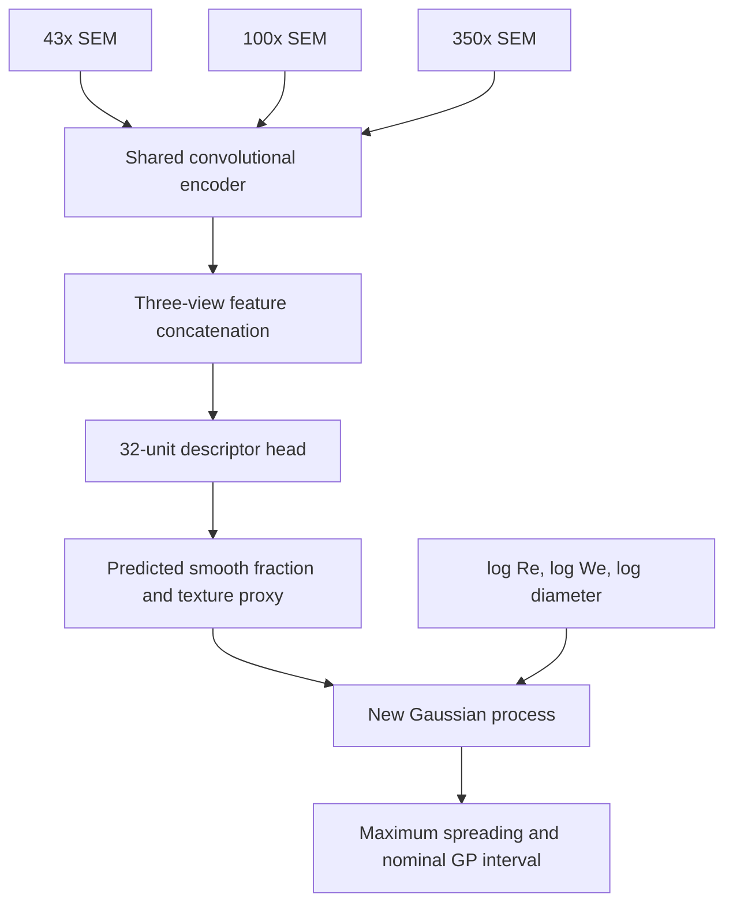

# SEM image training — release 2.1

Prepared for Parth Sharma · 23 September 2026

## What was actually trained

A 9,070-parameter multi-view convolutional neural network was trained directly on pixels from the supplied SEM photographs. Its two predicted surface descriptors feed a newly fitted Gaussian process that predicts maximum spreading. This is a two-stage image-to-descriptor-to-impact model, not an end-to-end CNN trained directly on impact labels.

- 39 original TIFFs: 13 surfaces × 43×, 100× and 350× magnification.
- 36 textured-surface images are available for training; the 3 REF-H images are excluded from every optimizer fit.
- Every outer fold excludes all three images of one textured surface: 33 images train the CNN, and the excluded three are used only at inference.
- All rotations/reflections inherit their parent surface split. No crop/image from a held-out surface becomes a training example.

## Results

| Evaluation | Existing geometry GP | SEM CNN + GP |
|---|---:|---:|
| LOSO RMSE | 0.039973 | 0.038385 |
| REF-H RMSE | 0.059096 | 0.064789 |

The SEM branch reduces fixed-candidate LOSO RMSE by **3.97%**, winning on **8/12** textured surfaces. Its paired 4,000-draw surface-bootstrap difference interval is [-0.003847, +0.000501]. It includes zero, so a reliable improvement is not established.

REF-H performance worsens. The image branch is therefore offered as an experimental option; the deployment default stays with the original GP. The original four-model nested selection experiment was not rerun with SEM as a fifth candidate, and its metrics must not be described as validation of an automatic five-model selector.

| Held-out surface | SEM GP RMSE | Existing GP RMSE |
|---|---:|---:|
| D100 | 0.037232 | 0.035128 |
| D200 | 0.027823 | 0.028587 |
| D400 | 0.042388 | 0.041448 |
| D50 | 0.053651 | 0.059353 |
| D600 | 0.043812 | 0.040310 |
| D800 | 0.040587 | 0.039177 |
| S100 | 0.021074 | 0.034028 |
| S200 | 0.038538 | 0.040120 |
| S400 | 0.035768 | 0.035873 |
| S50 | 0.045191 | 0.050062 |
| S600 | 0.034543 | 0.034779 |
| S800 | 0.028794 | 0.030772 |

## Image preparation

Each supplied 2560×2048 grayscale image is cropped to [0, 0, 2560, 1880], excluding the microscope annotation/scale-bar footer, then resized to 128×128 with Lanczos resampling. The ordered three-view array is standardized per image by its own mean and standard deviation. Magnification is represented by the fixed view order, not by reading text from the image. Training adds rotations, reflections and small intensity perturbations. Inference averages four rotations deterministically.

The exact training pixels are stored in data/sem/training_pixels.npz. Cropped display thumbnails and a manifest containing original TIFF SHA-256 hashes are included. Original TIFFs remain in the user’s already supplied dataset archive and are not duplicated in the delivery ZIP. Retraining uses the included training arrays; no download or original TIFF is required unless regenerating preprocessing.

## Learning architecture



The encoder uses convolution channels 1→8→12→16, SiLU activations, stride-2 downsampling and 2×2 adaptive pooling. The concatenated view representation feeds a 32-unit head with dropout 0.1 and two sigmoid outputs. Training uses AdamW, learning rate 0.002, weight decay 0.001, gradient norm clipping at 5, seed 23 and a fixed 250 epochs. Epoch count and architecture were fixed before inspecting the new held-out results. One initialization was evaluated; seed variability remains unquantified.

**Descriptor targets are weak labels:** the existing geometry-derived smooth fraction and texture volume per area / 25. They are not new pixel annotations or independent ground-truth SEM measurements. The CNN learns to approximate these descriptors from appearance. Both GP training rows and test rows use estimates from the same fold-local CNN, avoiding a train/test mismatch between measured and predicted descriptors.

Each fold GP fits its own scaler, target normalization, Matérn 3/2 ARD kernel and observation noise using training surfaces only. Held-out impact targets are used only for scoring. The final CNN and GP fit all 12 textured surfaces; REF-H remains out of fitting.

## Uncertainty limits

Nominal conditional-GP interval coverage is 87.98% under LOSO and 59.2% on REF-H. These intervals do not propagate image-encoder uncertainty and are not conformal-calibrated. The UI labels them nominal and experimental. No guaranteed 90% coverage is asserted.

Only 12 independent textured surfaces exist. Multiple magnifications and augmentations do not increase that number. Imaging style, field of view, proxy-label quality and missing wettability can all limit generalization. REF-H was historically inspected and is a stress test, not a new blind test.

## Use the trained image model

On the live site, choose SEM image model to inspect the 39 source-image crops, then select a surface and press “Predict using this image set.” CNN descriptors for the supplied image triplets are precomputed; the GP inference is live. The site does not claim to run a CNN on a newly uploaded image.

For a new triplet in the same imaging format:

```bash
python -m pip install -r requirements-sem.txt
python -m droplet.sem_infer --images surface_43.tif surface_100.tif surface_350.tif --D_mm 2.5 --V 1.5
```

Use --rho, --mu and --sigma for other fluid properties. The release expects the supplied 2560×2048 imaging layout; it rejects unsupported dimensions instead of silently applying the footer crop incorrectly. Other magnifications or instruments need separate validation.

To reproduce the fixed image experiment:

```bash
python -m droplet.sem --workers 2
python -m unittest discover -s tests -v
node tests/check_parity.mjs
```

To regenerate the training arrays, place the original 39 TIFFs in data/sem_original/ and run `python -m droplet.sem --prepare`. CNN weights are provided as a numerical NPZ with an integrity hash and as a PyTorch state dictionary. The inference command loads the numerical NPZ.

## Verification

- 18 Python tests passed, including complete image-split isolation, footer crop checks, exported GP agreement and metric recomputation.
- A pixel ablation test confirms that replacing real images with blank inputs changes the trained CNN outputs.
- 30 Python/JavaScript cases across 5 GP bundles: maximum point difference 2.7e-12, maximum interval difference 3.08e-12.
- The new-photo Python command was run on the actual D200 TIFF triplet; its JSON result is saved as results/sem/new_image_example.json.
- Browser UI automation remains unavailable in the static preview profile. JavaScript syntax and referenced assets were checked.
