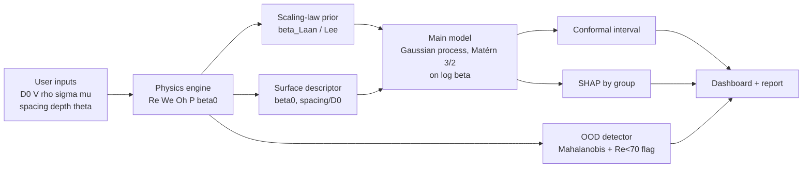

# Droplet Intelligence — Phase 1 Audit & Plan

Sep 23, 2026 · @Parth Sharma

## Status

The final model is a Gaussian process, not XGBoost: it has the lowest error on surfaces it never trained on (0.040 vs 0.056) and predicts the smooth REF-H surface to 1.9% mean error.

- **Data quality:** 1,498 + 125 rows, zero missing values, zero duplicates. Recomputed Re and We match the CSV to within 5×10⁻⁷ relative error.
- **Surface description:** smooth-plateau fraction φ measured from SEM; REF-H is φ = 1 by definition, which removed the arbitrary-encoding problem.
- **Final model:** Gaussian process, ID RMSE 0.036, unseen-surface RMSE 0.040, REF-H RMSE 0.059 (95% CI 0.044–0.073).
- **REF-H contact angle** is not in the dataset; a similar coating on smooth Al measures \~114°.

Full line-up in Model stack below; the detailed phase write-ups are in the Phases 2–4 report tab. Code: `src/models_extra.py`, `src/phases.py`.

## Data dictionary

The main file has 14 columns; four are outcomes, and two (Re, We) are derived from the others. Columns per the [data descriptor](https://www.sciencedirect.com/science/article/pii/S2352340925004275).

| Feature | Unit | Physical meaning | Type | Role | Leakage risk |
| --- | --- | --- | --- | --- | --- |
| Sample name | — | Surface ID (D50…S800) | categorical | group key for CV | Yes, if used as a feature: pure memorisation |
| Droplet diameter D₀ | m | Pre-impact size (6–8 µL drops) | continuous | input | Low |
| Impact velocity V | m/s | Kinetic energy source (0.5–1.6) | continuous | input | Low |
| Density ρ | kg/m³ | Fluid inertia | continuous | input | Low, but only 5 distinct fluids |
| Surface tension σ | N/m | Capillary restoring force | continuous | input | Low, only 5 distinct fluids |
| Dynamic viscosity μ | Pa·s | Viscous dissipation (1–160 mPa·s) | continuous | input | Low, only 5 distinct fluids |
| Channel spacing | µm | Texture pitch (50–800) | continuous | input | Undefined for REF-H |
| Channel depth | µm | 6.0 ± 0.7 or 26.1 ± 3.1 | binary in practice | input | Undefined for REF-H |
| Reynolds number | — | Inertia / viscosity | derived | input | Recompute and check |
| Weber number | — | Inertia / capillarity | derived | input | Recompute and check |
| Contact time | s | Time on surface before lift-off | target | secondary target | High if used as input |
| Rebound energy efficiency | — | Rebound PE / impact KE | target | secondary target | High if used as input |
| Max spreading factor βmax | — | Dmax / D₀ | target | **primary target** | — |
| Max lamella velocity | m/s | Peak spreading speed | target | auxiliary target | High: measured during spreading, strongly tied to βmax |

Three things matter for modelling:

Verified from the CSVs:

- **Texture is a crosshatch, not parallel channels.** The laser scans in both directions, so each surface is a grid of square plateaus 50–800 µm apart.
- **Fluids: 5 families, 40 temperature states.** Properties were corrected for the measured temperature, so ρ, σ, μ vary slightly inside each glycerol level. They still move together, so SHAP should be reported per group.
- **Replicates:** 292 of 297 conditions are clean groups of 5 repeats (grouped by surface, glycerol level and velocity cluster). All CV splits on these groups.
- **No rebound label.** Contact time and rebound efficiency are filled for all 1,498 rows (η min 0.0045). The “132 non-rebounds” from the Biomimetics paper are not flagged. 148 of the 300 runs at 91 wt.% have η < 0.02, so a threshold label is possible, but the threshold would be our choice.
- **REF-H file has 10 columns:** no spacing, depth, contact time or rebound efficiency. Only βmax and lamella velocity can be compared across surfaces.
- **Coverage matches:** REF-H spans the same fluids (25 rows each) and nearly the same We (9.8–110 vs 8.0–119). It is a surface shift, not an input-range shift.
- **Ranges:** βmax 1.44–3.34 on textured, 1.44–2.83 on REF-H. Water reaches We 97, so high We is not confined to viscous mixtures (the Biomimetics paper implies otherwise).

## Physics formulation

The backbone is a published universal scaling for βmax that already handles smooth and rough surfaces through one wettability term, β₀. That is exactly the bridge REF-H needs.

**1. Recompute the groups and check against the CSV** (expect <1% mismatch; larger means a different diameter definition or temperature-corrected properties):

```latex
\mathrm{Re}=\frac{\rho V D_0}{\mu},\qquad \mathrm{We}=\frac{\rho V^2 D_0}{\sigma},\qquad \mathrm{Oh}=\frac{\mu}{\sqrt{\rho\sigma D_0}}=\frac{\sqrt{\mathrm{We}}}{\mathrm{Re}}
```

Oh is not a new input: it is a function of Re and We. The "physics" feature set is really two independent groups plus geometry, which partly explains why it only modestly beats raw inputs.

**2. Laan et al. (2014) Padé interpolation** between the capillary and viscous limits, A = 1.24, fitted for 10 < We < 1700 and 70 < Re < 17000:

```latex
\beta_{max}\,\mathrm{Re}^{-1/5}=\frac{P^{1/2}}{A+P^{1/2}},\qquad P=\mathrm{We}\,\mathrm{Re}^{-2/5}
```

The dataset's Re goes down to about 9, so the 91 wt.% glycerol runs sit outside this law's fitted range. That is itself a physics-OOD region worth flagging in the UI.

**3. Lee et al. (2016) wettability correction** — subtract the spreading a drop would have at zero velocity, β₀, which is set by contact angle. This is what lets one curve cover smooth and rough surfaces:

```latex
\left(\beta_{max}^2-\beta_0^2\right)^{1/2}\mathrm{Re}^{-1/5}=\frac{P^{1/2}}{A+P^{1/2}}
```

β₀ from spherical-cap geometry at contact angle θ (use advancing angle as a proxy for the dynamic angle; refit A on training folds only):

```latex
\beta_0=\sin\theta\left[\frac{4}{(1-\cos\theta)^2(2+\cos\theta)}\right]^{1/3}
```

**4. Physics-motivated features** (each needs a rationale; test, don't assume):

| Feature | Definition | Meaning | Expected effect | Status |
| --- | --- | --- | --- | --- |
| P | We·Re^(−2/5) | Capillary vs viscous limit | Sets which regime governs βmax | Core |
| β\_Laan | Padé law above | Physics prior prediction | Backbone for residual model | Core |
| β₀ | from θ\_adv | Wettability at rest | Separates REF-H from textured | Core if REF-H θ is known |
| spacing / D₀ | pitch ÷ drop size | Texture scale vs drop | Only widest pitch (\~0.3 D₀) likely matters | Test |
| depth / spacing | aspect ratio | Air-cushion geometry | Cassie stability | Test |
| ρV²·s/σ | dynamic pressure vs capillary pressure across a gap s | Impalement (Cassie → Wenzel) risk | Should matter for rebound more than βmax | HYPOTHESIS; needs actual gap width, not pitch |
| Bo | ρgD₀²/σ | Gravity vs capillarity | \~0.7 for water, near-constant | Probably drop |

Wetting states for the report: Cassie–Baxter (drop rests on texture tops + trapped air, cosθ\* = f(cosθ + 1) − 1) gives rebound; Wenzel (liquid fills grooves, cosθ\* = r cosθ) gives pinning. Spreading happens in about 2–3 ms, mostly before the texture can pin anything, which is why geometry barely moves βmax.

## Why REF-H is hard, and the leakage traps

REF-H fails for a structural reason, not a tuning reason: the model is asked about a surface type it has zero examples of, described by inputs it has never seen combined that way.

**Why REF-H is out of distribution**

1. **Different wetting physics.** Textured samples are superhydrophobic (Cassie state, air cushion). REF-H is smooth and only hydrophobic, so contact angle and dissipation at the contact line differ. βmax should be higher on REF-H at low We, where wettability matters most (Lee et al.).
2. **Undefined geometry.** Spacing and depth have no true value for a smooth plate. Encoding it as depth = 0 or spacing = ∞ is pure extrapolation for trees, which predict a constant outside the training range.
3. **No surface variable carries the difference.** In the textured set, geometry barely changes βmax, so the model learns “surface doesn't matter”. That is true within the training domain and false for REF-H.
4. **Small n.** 125 points, likely 25 fluid/velocity conditions × 5 repeats. Report errors with bootstrap CIs, not single numbers.

**Leakage traps**

| Trap | Why it inflates scores | Fix |
| --- | --- | --- |
| 5 repeats per condition split across train/test | Test point has a near-twin in train | GroupKFold on (surface, fluid, velocity) condition ID |
| Random 80/20 reported as "generalisation" | Every surface is in train | Leave-one-surface-out (12 folds) + REF-H holdout |
| Sample name as a feature | Model memorises per-surface offsets | Never an input; group key only |
| Contact time, rebound efficiency, lamella velocity as inputs | Measured on the same impact | Targets only |
| Tuning on REF-H | OOD score becomes an ID score | REF-H touched once, at the end; tune on LOSO folds |
| Fitting A or scalers on all data | Test info leaks into features | Fit inside each training fold |
| Confound: fluid properties move together along one glycerol axis | Credit for ρ, σ, μ is split arbitrarily | Group SHAP by fluid / impact / surface; report error per glycerol level |

## Prior ML on this dataset

The dataset's own authors already published ML on it, so "XGBoost gets high R² on βmax" is not new; cross-surface generalisation is the open gap. Judges at an IISc droplet workshop may know this paper.

[Biomimetics 10(6):357 (2025)](https://www.mdpi.com/2313-7673/10/6/357) reported:

- Gaussian Process Regression (isotropic exponential kernel), chosen from 28 MATLAB models, 7 raw inputs, 80/20 random split.
- βmax: R² > 0.96, about 3% mean absolute percentage error. Re/We inputs did slightly *worse* than the 7 raw inputs.
- Shapley: velocity dominates βmax; channel depth and pitch show no considerable effect on spreading. Pitch does affect rebound efficiency and contact time.
- No cross-surface test, no REF-H evaluation, no leakage-aware grouping.

**What this means for you**

| Idea | Classification |
| --- | --- |
| XGBoost/GPR on raw or Re/We inputs | Established (done on this exact data) |
| Leave-one-surface-out + REF-H holdout with grouped CV | Adaptation, but new for this dataset |
| Physics backbone (Laan/Lee) + ML residual | Adaptation of existing residual-learning practice |
| β₀ / contact angle as the shared surface descriptor so smooth and textured live in one feature space | Potentially novel for ML on this data; requires literature verification |
| Conformal intervals + OOD score calibrated on held-out surfaces | Adaptation; the "calibrated on unseen surfaces" part is the interesting bit |
| Multi-task: βmax + rebound yes/no + rebound efficiency | Adaptation; supported by real labels |

Random-split R² should appear only as a context row. The headline number is REF-H error and LOSO error.

## Phase 2 results

M3 hybrid XGBoost wins every protocol, but only narrowly, and all ML models lose 38–40% accuracy on REF-H. Fixed hyperparameters throughout; REF-H predicted once, never used for tuning.

| Model | ID RMSE (grouped CV) | LOSO RMSE | Worst LOSO surface | REF-H RMSE \[95% CI\] | REF-H bias | REF-H R² |
| --- | --- | --- | --- | --- | --- | --- |
| M3 XGB hybrid (raw + Re, We, Oh, P, geometry ratios) | **0.044** | **0.048** | 0.088 (D50) | **0.061** \[0.044, 0.077\] | −0.007 | 0.976 |
| M1 XGB raw (paper baseline) | 0.046 | 0.051 | 0.098 (D50) | 0.065 \[0.050, 0.080\] | +0.014 | 0.973 |
| M5 power law + XGB residual | 0.050 | 0.054 | 0.119 (D50) | 0.069 \[0.053, 0.085\] | +0.030 | 0.969 |
| M2 XGB Re, We, Oh + geometry (paper PIML set) | 0.051 | 0.054 | 0.111 (D50) | 0.070 \[0.052, 0.086\] | +0.028 | 0.969 |
| M2b XGB Re, We only | 0.086 | 0.088 | 0.211 (D50) | 0.076 \[0.054, 0.095\] | +0.031 | 0.963 |
| M4 MLP (log Re, log We, geometry) | 0.062 | 0.083 | 0.144 | 0.148 \[0.112, 0.180\] | −0.106 | 0.857 |
| Power law β = a·We^b·Re^c (fitted) | 0.134 | 0.131 | 0.157 | 0.106 \[0.085, 0.126\] | +0.029 | 0.927 |
| Laan 2014 law (A refitted) | 0.231 | 0.231 | 0.257 | 0.219 \[0.177, 0.260\] | −0.049 | 0.688 |

RMSE is in units of βmax (typical value \~2). CIs are bootstrapped over the 25 REF-H conditions.

**What the numbers say**

1. **Raw vs physics features is a wash.** M1 and M2 are within 0.005 RMSE everywhere, matching the Biomimetics finding. Adding Re/We does not by itself earn the word “physics-informed”.
2. **Geometry does matter, contrary to the prior paper.** Dropping it (M2b) nearly doubles ID error. Without geometry, deep-channel surfaces are under-predicted (D50 by 0.05) and shallow ones over-predicted: deeper texture spreads further. TO BE VALIDATED: surfaces were tested on different days, so a batch effect is not ruled out.
3. **REF-H is only mildly out-of-distribution for βmax** (about 2% error), because spreading is inertia-dominated. The error concentrates at high We: models over-predict REF-H by 0.03–0.08 in the top We tercile. HYPOTHESIS: the air cushion on textured surfaces reduces friction, so textured surfaces spread more at high We than a smooth plate.
4. **The encoding of “no texture” is arbitrary, and it moves the result.** Feeding REF-H as spacing/depth = 0/0, 50/6, 800/6, 800/25 or 5000/0 changes M2's REF-H RMSE from 0.062 to 0.085 (+36%; M1 0.059–0.072). A scientifically defensible model must not depend on a made-up number.
5. **The published scaling laws fit this superhydrophobic data poorly** (Laan R² 0.71 in-distribution). They were fitted on wettable surfaces. A residual on top of a fitted power law helps extrapolation less than hoped so far.
6. **The small MLP fails on REF-H** (bias −0.11): with \~300 conditions it extrapolates badly. Drop it or regularise much harder.

## Phase 3–4: surface descriptors from SEM

The missing geometry numbers were measured from the SEM images themselves, and they give REF-H a physical place in feature space: it is the limit where the smooth plateau covers the whole surface.

- **Key fact from the data paper:** REF-H “resembles the surface between the laser-made channels”. SEM confirms it: the plateaus show the same rolling marks as REF-H, and the laser tracks are rough recast bands.
- **Measured track width:** local-variance segmentation of the 43× images (1.16 µm/px) gives about 45 µm for deep tracks and 30 µm for shallow ones (±10 µm, pooled over pitch ≥ 200 µm where tracks don't merge). The segmentation reads REF-H as 0.0% textured.
- **New descriptors:** smooth-plateau fraction φ = ((s − w)/s)² and texture volume (1 − φ)·depth. REF-H is φ = 1, texture volume = 0, by definition rather than by a made-up encoding. Training surfaces span φ = 0.01 (D50) to 0.93 (S800).
- **Result:** REF-H error no longer depends on an arbitrary choice. Shifting w by ±10 µm moves every model's REF-H RMSE by at most 0.005, against 0.023 before.

```latex
\varphi=\left(\frac{\max(s-w,\,0)}{s}\right)^2,\qquad V_{tex}=(1-\varphi)\,h
```

REF-H contact angle is still unknown. A closely related fluorinated phosphonic-acid SAM on smooth aluminium measures 114.5° static ([Molecules 2024](https://www.mdpi.com/1420-3049/29/3/706)); textured surfaces measure 160–166°. It is not used as a model input, because it barely varies across the 12 training surfaces and the model would have nothing to learn it from.

## Model stack and protocol

**Final model: Gaussian process regression** (Matérn 3/2 kernel, one length-scale per input, fitted on log βmax). It was chosen on the leave-one-surface-out score, never on REF-H. XGBoost is kept only as a reference row.

All 13 models got the same inputs: log Re, log We, log D₀, smooth-plateau fraction φ and texture volume (Phase 3–4 section), with REF-H at φ = 1. Sorted by unseen-surface error:

| Model | ID RMSE | LOSO RMSE (selection) | Worst surface | REF-H RMSE | REF-H bias |
| --- | --- | --- | --- | --- | --- |
| **Gaussian process (final)** | **0.036** | **0.040** | 0.059 (D50) | 0.059 | +0.004 |
| Random forest | 0.044 | 0.046 | 0.080 (D50) | 0.063 | +0.009 |
| Extra trees | 0.044 | 0.046 | 0.096 (D50) | 0.063 | +0.009 |
| FT-Transformer | 0.045 | 0.051 | 0.098 (D50) | 0.067 | +0.010 |
| CatBoost | 0.045 | 0.052 | 0.114 (D50) | 0.063 | +0.008 |
| Deep ensemble (5 MLPs) | 0.045 | 0.053 | 0.101 (D50) | 0.067 | +0.020 |
| XGBoost (reference) | 0.046 | 0.056 | 0.115 (D50) | 0.059 | +0.010 |
| LightGBM | 0.051 | 0.059 | 0.136 (D50) | 0.060 | +0.011 |
| Quadratic ridge | 0.054 | 0.064 | 0.135 (D50) | 0.070 | +0.017 |
| MLP | 0.052 | 0.070 | 0.167 (D50) | 0.082 | +0.024 |
| kNN | 0.132 | 0.076 | 0.178 (D50) | 0.061 | +0.008 |
| SVR (RBF) | 0.045 | 0.108 | 0.305 (D50) | 0.049 | −0.002 |
| Kernel ridge | 0.044 | 0.257 | 0.825 (D50) | 0.048 | −0.010 |

SVR and kernel ridge score best on REF-H, but they fall apart on unseen textured surfaces (worst surface 0.31 and 0.83). Picking them would mean choosing on the test set. Also tested: a CNN that reads φ from SEM images and feeds the GPR (unseen-surface RMSE 0.043), and an Isolation Forest + Mahalanobis OOD detector. Not used: TCN (no time-series data) and domain-adversarial nets (12 near-identical source domains).

**Protocol**

1. Condition ID = (surface, glycerol wt.%, velocity bin). All CV is grouped on it.
2. **ID score:** GroupKFold (5) on textured data.
3. **Surface-OOD score:** leave-one-surface-out, 12 folds. Hyperparameters tuned here.
4. **REF-H score:** train on all textured data, predict REF-H once. Report RMSE, MAE, worst-case error, bias (mean signed error), bootstrap 95% CI, and ID→OOD degradation %.
5. Slice errors by We tercile, glycerol level, depth class, spacing.

**Uncertainty and OOD** (no invented confidence numbers)

- Prediction interval: split conformal, with calibration residuals taken from LOSO folds so intervals reflect surface shift, not just noise. Check empirical coverage on REF-H.
- OOD score: Mahalanobis distance in (log Re, log We, β₀, spacing/D₀), threshold set at the 95th/99th percentile of training distances, plus ensemble disagreement. Also flag Re < 70 (outside the scaling law's fit).
- UI reads: “βmax = 2.41, 90% interval \[2.28, 2.55\]; OOD: moderate (distance at 97th percentile)” — numbers illustrative only.

**Explainability:** TreeSHAP on the residual model, reported by feature group (fluid / impact / surface) because ρ, σ, μ are collinear. Plain-language templates only fire when the SHAP sign matches the physics sign; otherwise the UI says the model and physics disagree.

**Multi-task:** βmax regression + rebound yes/no classification (from missing contact time) + rebound efficiency. Surface geometry should matter for the latter two, which gives the Surface Explorer something real to show.

## Architecture

One Python package feeds a FastAPI backend and a single-page dashboard; the physics engine runs before and after the ML, not just as feature prep.



Repo: `src/physics`, `src/features`, `src/models`, `src/evaluation` (grouped CV, LOSO, REF-H), `src/ood`, `src/explain`, `backend/` (FastAPI `/predict`, `/explain`, `/benchmark`), `frontend/` (5 pages: Lab, Surface Explorer, Explainability, Benchmark, Report). For a 12-day build, Streamlit is a safer frontend than Next.js; switch only if time is left.

## Plan to Interface 2

Twelve days to Oct 5 is enough if the evaluation harness is finished before any modelling, and the UI starts only once numbers are real.

| Dates | Phase | Done when |
| --- | --- | --- |
| Sep 23–24 | 1. Numeric audit — done Sep 23 | Re/We recalc matches, distributions, REF-H schema, rebound label confirmed |
| Sep 25–26 | 2. Baselines M1–M5 — done Sep 23 | Grouped-CV, LOSO and REF-H numbers for all three |
| Sep 27–28 | 3–4. Physics residual M5/M6 | REF-H error vs M2, with CI |
| Sep 29 | 5. Uncertainty + OOD | Conformal coverage on LOSO and REF-H |
| Sep 30 | 6–7. SHAP + benchmark table | Final model chosen on evidence |
| Oct 1–2 | 9–10. API + dashboard | 5 pages running locally |
| Oct 3–4 | 11. Pitch + poster tie-in | 30 s / 1 min / 3 min scripts, rehearsed demo |

Fallback if M6 is blocked (no REF-H contact angle): ship M5 and present β₀ as the explicit next step, with the Lee et al. argument for why it should close the gap.

## Open questions

- [x] Is the hackathon held at Interface 2 (Oct 5–7), or does it have its own deadline?
- [x] REF-H contact angle is not in the dataset. Can you get it (lab contact, literature value for FDPA on smooth Al), or should M6 use a stated assumption with a sensitivity sweep?
- [x] Team size: one person or several? Changes how much of the UI is realistic.

## Sources

- [Mendeley dataset wsh8rxwd38](https://data.mendeley.com/datasets/wsh8rxwd38/1)
- [Data in Brief data descriptor (2025)](https://www.sciencedirect.com/science/article/pii/S2352340925004275)
- [Biomimetics 10(6):357 — ML on the same dataset (2025)](https://www.mdpi.com/2313-7673/10/6/357)
- [Laan et al., Phys. Rev. Applied 2, 044018 (2014)](https://pure.uva.nl/ws/files/2345931/160784_Maximum_Diameter_of_Impacting_Liquid_Droplets.pdf)
- [Lee et al., J. Fluid Mech. 786, R4 (2016)](https://www.cambridge.org/core/journals/journal-of-fluid-mechanics/article/abs/universal-rescaling-of-drop-impact-on-smooth-and-rough-surfaces/763B4B0B79869BBE5238A614C6C8F2CF)
